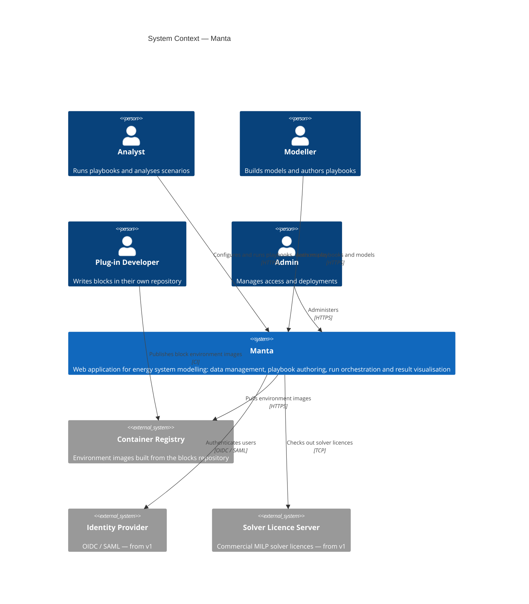
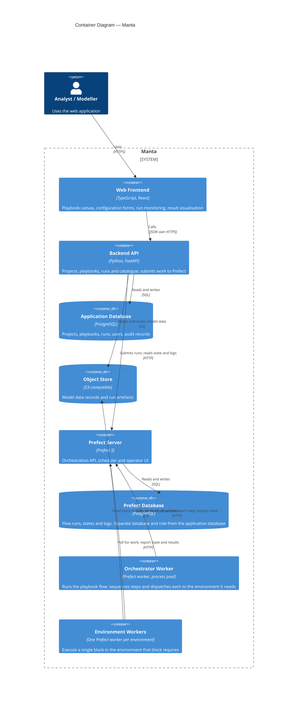
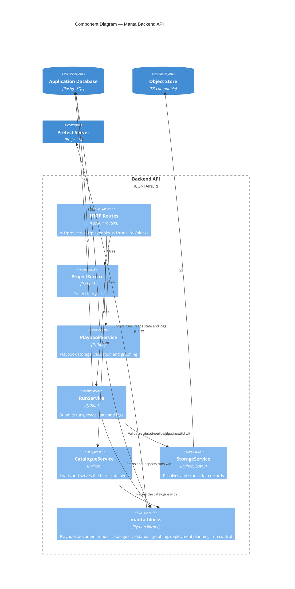

# 02 — System architecture

## Guiding principles

These are the decisions that answer most "why is it built this way?" questions. [**TODO** perhaps these should go into each relevant subsection instead?
Keep only the ones relevant to the overall design here.]

1. **Manta orchestrates; it does not compute.** The backend never executes modelling
   code.
It submits work to Prefect and reads the result back.
This keeps the API
   process small, stateless with respect to runs, and independent of the scientific
   Python stack.

2. **Prefect is the single source of truth for run state.** Manta stores no status,
   progress or log columns.
A run row links a project to a Prefect flow run identifier
   and nothing more.
State that is stored twice eventually disagrees.

3. **The environment is the unit of isolation.** A block declares which environment it
   needs; that environment becomes a container image and a Prefect work pool.
A workflow
   with multiple dependencies (e.g. modelling frameworks) is separated into blocks.

4. **Everything about a block can be known without importing it.** No single Python
   environment can import every block, so blocks are described by data — a catalogue —
   rather than by code.
Manta's backend can validate, draw and plan a playbook
   composed entirely of blocks it could never load.

5. **The playbook document is the interchange format.** A playbook is written, edited,
   stored, sent and executed as the same document.
What runs is what was on
   screen.

## Level 1 — System context

Note that the Plug-in Developer's relationship with Manta is indirect.
They publish an
image and a block description; they do not deploy code into Manta's application
process.

## Level 2 — Containers

Three things worth noticing in that diagram:

- **The backend never talks to a worker, and no worker talks to the backend.** All
  coordination goes through the Prefect server.
Workers can therefore live in a
  different network segment, scale independently, and be restarted without the API
  noticing.
- **The object store is the only data path between steps.** Workers are separate
  processes — usually separate containers — so a record passed from one step to the
  next is a URL, never an in-memory object.
- **Prefect has its own database.** Shared server, separate database and separate
  role, so PostgreSQL's own permissions enforce the boundary.
See
  [03](03-workflow-orchestration.md#prefects-own-database).

## Level 3 — Backend components

`manta-blocks` is a library dependency, not a service.
It is the same package that
runs inside the workers, which is what guarantees that the playbook Manta validates
and the playbook the orchestrator executes are interpreted identically.
See
[05](05-repository-interface.md).

## Repositories

| Repository | Contains | Consumers |
| --- | --- | --- |
| `manta` | Backend API, frontend, application database schema, deployment manifests | The product |
| `blocks` | The block framework, the playbook engine, the blocks OET ships, and the Prefect flows that execute them | Manta, and anyone running playbooks from a terminal |
| *(third party)* | Plug-in blocks with their own environments | Referenced by catalogue and image, never vendored |

`blocks` is deliberately usable without Manta.
Its test suite runs with no database,
no web server and — in its default environment — without PyPSA installed.
That last
constraint is what proves a block's dependencies stay a block's own problem.

## Backend conventions

The backend follows a Model–Service–Controller layering, one set per domain entity:

- **Entity** — a SQLAlchemy model in `entities/`, inheriting a base that supplies
  `id`, `uuid` and `created_at`.
- **Service** — business logic in `services/`, receiving a database session by
  dependency injection.
Stateless; no instance state beyond the session.
- **Route** — a FastAPI router in `routes/v1/` that validates input and delegates.
- **DTOs** — Pydantic request models in `routes/v1/requests/` and result models in
  `services/results/`.

Persistence is PostgreSQL through SQLAlchemy 2.0 with the synchronous `psycopg`
driver; schema changes go through Alembic migrations, run at application startup
before the HTTP server accepts requests.

The entities relevant to this design:

| Entity | Purpose | Notably absent |
| --- | --- | --- |
| `Project` | Owns playbooks, runs and data | — |
| `Playbook` | Stores a playbook document and its configuration document | Any interpretation of their contents — that is `manta-blocks`' job |
| `Run` | Links a project and playbook to one Prefect flow run | Status, progress, logs, results |

`Run`'s foreign keys cascade on delete: removing a project removes its runs.
The
Prefect flow runs they pointed at are not deleted, and are subject to Prefect's own
retention policy.
