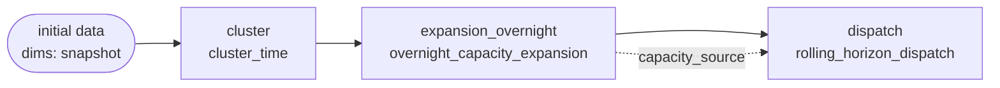
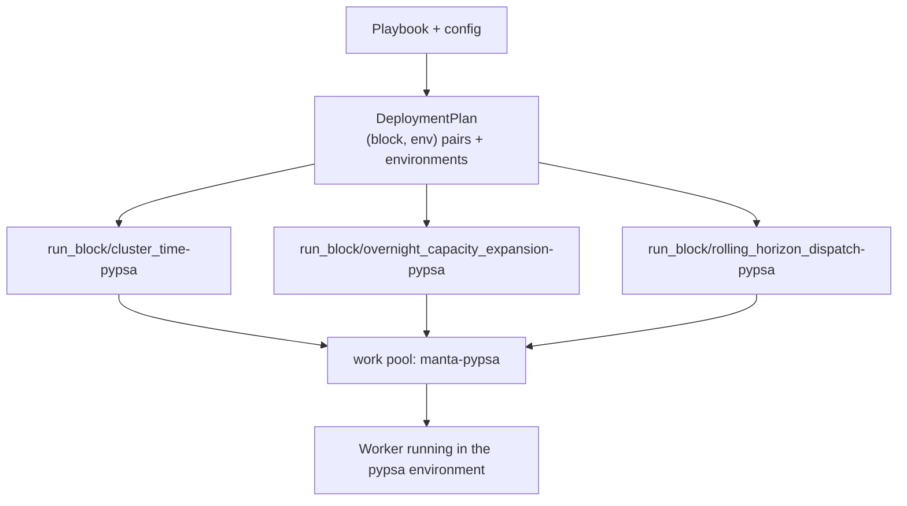

# 04 — Blocks and playbooks

The domain model, defined in the `blocks` repository. Two packages with a deliberate
one-way dependency: `blocks` never imports `playbooks`, so the playbook engine can
become its own project later without untangling anything.

```
src/
  blocks/          A block, and everything needed to describe one without running it
    core.py        DataRecord, BlockDims, ConfigSchema, MantaBlock
    registry.py    Which blocks exist, and the catalogue that describes them
    environments.py  The environments blocks run in
    deployment.py  What needs deploying, and the one place deployment names are made
    entrypoint.py  The Prefect flow every block deployment runs
    library/       The blocks Manta ships (these need PyPSA)
  playbooks/       Blocks chained together
    playbook.py    Steps, wiring, conditions
    validation.py  Everything checkable before running
    yaml_io.py     Playbooks as documents: reading, writing, sending
    graph.py       A playbook as boxes and arrows, worked out without running it
    execution.py   Running a playbook, here or across environments
    deploy.py      Working out what to deploy, and creating it
    control.py     The front door: deploy, start a run, ask how it is doing
```

## A block

A block is one unit of work on an energy model. It reads a record, does something, and
returns a record pointing at the result.

```python
class ShrinkConfig(ConfigSchema):
    factor: int = 2


@register("shrink")
class Shrink(MantaBlock[ShrinkConfig]):
    """Make the model smaller."""

    ENV = "pypsa"
    CONFIG = ShrinkConfig
    DIMS = BlockDims(requires=frozenset({"snapshot"}))

    def flow(self, record: DataRecord) -> DataRecord:
        ...
```

Everything a block says about itself is declared on the class, so other tools can read
it without running — or even importing — the block:

| Declaration | Meaning |
| --- | --- |
| `ENV` | The environment it needs, as a logical name |
| `MANIFEST` | For a third-party block, where to find that environment |
| `CONFIG` | Its settings, as a Pydantic model |
| `DIMS` | The dimensions it requires, adds and removes |
| `INPUTS` | Settings filled in by another block's output rather than by the user |
| `OUTPUTS` | The results it offers to later blocks |

A block class is checked the moment it is written. Every name in `INPUTS` must be a
setting that can hold a record *and* has a default, so a block is always usable with
nothing wired to it. Getting this wrong raises at class-creation time, not at run
time.

### `DataRecord`

```python
@dataclass
class DataRecord:
    url: str
```

A record is a pointer, never the data. It is passed between processes and machines,
which a loaded model could not survive. Everything crossing a boundary travels as
`{"url": ...}`.

### Dimensions

Each block declares the dimensions it `requires`, `adds` and `removes` — `snapshot`,
`investment_period` and so on. Folding those declarations along a playbook's steps
determines what the data looks like at each point, and catches "this step needs
something an earlier step removed" before anything runs. The error message names the
step that removed it.

This is the most useful check the system performs, and it works entirely on
declarations.

### The registry, and why blocks are named

Blocks are looked up **by name**. A playbook can name a block it cannot import,
because no single Python environment can import them all.

The blocks Manta ships need PyPSA, so the registry records where they live rather than
importing them:

```python
_LAZY = {
    "cluster_time": "blocks.library.time_cluster:ClusterTime",
    ...
}
```

The module therefore imports cleanly in an environment with no PyPSA — and the
framework's default test environment deliberately has none, which is the proof that a
block's dependencies stay a block's own problem.

## The catalogue

If no environment can import every block, how does anything get a complete picture?

Each environment describes what it can import. Running `python -m blocks` in an environment
emits a JSON **catalogue**: for every block importable there, its name, environment,
one-line summary, dimensions, inputs, outputs, and its settings as a JSON Schema.
Merging the per-environment catalogues yields a description of every block in the
system.

```bash
pixi run -e full  python -m blocks > full.json
pixi run -e other python -m blocks > other.json
# merge_catalogues(...) → one description of everything
```

Settings that another block fills in are tagged `x-manta-input` in the schema, so a
form built from the catalogue knows to skip them: they are connection points in the
playbook, not something a user types.

The catalogue is what lets a process that could not import a single one of these
blocks still draw a playbook, offer its settings, and check how it is wired. It is the
contract between the two repositories — see [05](05-repository-interface.md).

A `BlockSpec` is what a playbook step actually holds: a block description plus,
*optionally*, the real class. Building, checking, drawing and deploying need only the
description. Only executing needs the class, and asking for one that is not available
says so plainly.

## A playbook

A playbook chains blocks into something you can run.

```yaml
name: cluster-expand-dispatch

initial_data:
  dims: [snapshot]

steps:
  - name: cluster
    block: cluster_time

  - name: expansion_overnight
    block: overnight_capacity_expansion
    when:
      config: globals.expansion_mode
      equals: overnight

  - name: dispatch
    block: rolling_horizon_dispatch
    when:
      config: globals.expansion_mode
      equals: overnight
    inputs:
      capacity_source: ${steps.expansion_overnight.output}
```

The same playbook can be built in Python; the two are interchangeable.

### Two ways work flows between steps

At the moment, playbooks assume most workflows have a linear structure:

- **The spine.** Every step is handed the record the previous step produced. This is
  how most work flows, and it is implicit.
- **Wires.** A step can additionally reach back for a *particular* earlier step's
  result and put it into one of its settings, written
  `${steps.<step>.<output>}`.

In the example, `dispatch` receives the record from the step before it *and* the
capacities the expansion step specifically decided.



Solid arrows are the spine; the dashed arrow is a wire.

### Settings live in a separate document

A playbook says what runs; a configuration document says how. Settings are filed by
step name, plus a `globals` section everything can see:

```yaml
globals:
  expansion_mode: overnight

cluster:
  n_hours: 3

dispatch:
  optimize_config:
    horizon: 168
    overlap: 24
```

Keeping them apart is what lets one playbook be run several ways — which is precisely
the scenario-analysis use case Manta exists to serve.

Because each step has its own name, the same block can appear twice with different
settings: `expansion_2030` and `expansion_2040` are two steps of one block.

### Conditions

`when: {config: <dotted path>, equals: <value>}` switches a step on or off **based on
the settings alone, never on the data**.

That restriction is what makes a playbook checkable and drawable before it runs: which
steps will execute is known up front. Steps switched off stay in the graph, marked as
not running, so the branch not taken is still visible and the user can change their
mind.

Which steps run is decided in exactly one place, and validation, graphing, deployment
planning and execution all ask that same question. They therefore cannot disagree.

### Playbooks inside playbooks

A step can be another playbook — referenced by locator, or written out in place, which
is what a browser with no filesystem sends.

Anything the inner playbook does not wire up itself is offered to the outer one as
`<step>.<setting>`, fed exactly like a block's own input. Its settings live under its
step's name, and it inherits the outer `globals` unless it has its own. Checking,
dimension folding and deployment planning all recurse; a problem inside a nested
playbook is reported against its full path, and a playbook that ends up containing
itself is reported rather than followed until the stack runs out.

## Checking a playbook

`playbook.issues(config)` returns everything wrong, without raising. Each issue names
the step it concerns and, where applicable, the exact setting — so a user interface can
mark the right box and the right field.

What is checked:

- Step names are unique and usable.
- Every wire points at an earlier step that really offers that result.
- A step that runs is not fed by one that does not.
- Every step finds the dimensions it needs still present.
- Settings belong to a step and match what that step accepts.
- Blocks sharing an environment name agree on what that environment is.

Nearly all of this works for blocks the checking process cannot import, using the
JSON Schema from the catalogue. The one thing that cannot travel is a rule a block
expresses in code — "exactly one of these two settings" — which can only be checked
where the block itself is importable. Those surface at run time instead.

## Drawing a playbook

`playbook.to_graph(config)` produces nodes and arrows as plain data: which steps run,
the dimensions at each point, which settings are wired to what. `to_mermaid()` renders
the same graph as a diagram.

Neither runs any of the playbook. With real blocks that matters: **asking for a
picture should not start a solver.**

## From playbook to deployments

Before a playbook can run, Prefect needs a deployment for each distinct
`(block, environment)` pair its active steps use. Working that out is a pure function
of the playbook and its settings:



Names are constructed in exactly one place: deployment `run_block/<block>-<env>`, work
pool `manta-<env>` by default. No other component should ever build these strings.

Steps needing the same pair share one deployment. Nested playbooks fold into the
parent's plan, with each step's path recorded from the outermost playbook inwards so a
conflict can be located.

Turning a plan into reality is the job of a **provisioner** — an interface with one
implementation per deployment target. (The code currently calls this `Renderer`;
`Provisioner` is the clearer name and is used throughout these documents.) It creates
or updates Prefect deployments bound to work pools. It deliberately does *not* create
work pools or start workers: those are long-lived infrastructure decisions belonging
to whoever operates the deployment (Manta's infra code/repo). What it does instead is report exactly which pools are missing
and what would create them.

## Current PoC state & TODOs

Carried from the `blocks` README on commit `f6dc47f`:

- **Records point at PyPSA netCDF files**, and a block writes a whole new file rather
  than only what it changed, because PyPSA cannot yet compare two networks or store a
  difference. Both are confined to one module. This does not yet match Manta's
  object-store data layer — see [08](08-open-questions.md#record-storage-and-format).
- **Resource requirements are not modelled.** No block declares CPU, memory or wall
  time, which will be needed when we deploy Manta on Kubernetes for the MVP.
- **Only the process/pixi provisioner exists.** A container or cluster provisioner is
  the second implementation of the existing interface.
- **Conditions cannot look at data**, only at settings. This is a deliberate trade for
  up-front checkability, but it does rule out data-dependent branching.
- **Every block so far produces exactly one result**, though `OUTPUTS` allows more.
