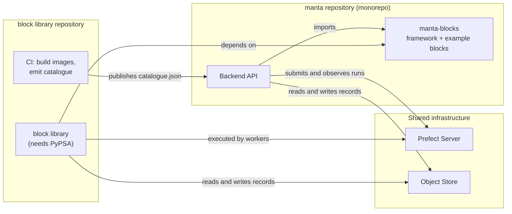

# 05 — Repository interface

How Manta and the `manta-blocks` package meet, and who owns what.

## The seam

**Decided:** Manta's backend takes a package dependency on `manta-blocks` — the
framework and a few example blocks, not the main library of modelling blocks — and
both sides talk to the same Prefect server and the same object store.

`manta-blocks` lives in the `manta` repository (a monorepo) and is published to PyPI
and conda from its own subtree; Manta depends on it as a workspace package.
The main block library — OET's PyPSA blocks, and other modelling frameworks in future
— lives in its own repository.
See [Monorepo and the block library](#monorepo-and-the-block-library).

There are three connections between Manta's backend and `manta-blocks`:



1. **A library dependency.** Manta imports `manta-blocks`: the playbook document model, the catalogue
   model, validation, graphing and run control.
Its runtime dependencies are Prefect,
   Pydantic, PyYAML and jsonschema — all of which Manta either already has or can
   trivially add.
PyPSA is deliberately absent from this package.
2. **The catalogue as a build artefact.** The block library's CI publishes a versioned
   `catalogue.json` describing every block in every environment.
Manta loads it and
   serves it to the frontend.
3. **A shared Prefect server and object store.** Manta submits and observes; workers
   execute and store.

Manta never imports a library block class, never needs a Pixi environment, and never
needs PyPSA.
The framework's default test environment having no PyPSA is what proves
this path works.

### Why not the alternatives

**Prefect only** — Manta submits `run_playbook/<env>` and imports nothing.
Cleanest
possible coupling, but Manta loses validation, graphing and the catalogue, so the
frontend cannot build forms, mark errors or draw the canvas.
The validation logic
would have to be reimplemented in TypeScript and kept in step by hand.
Rejected.

**`manta-blocks` as its own HTTP service** that Manta proxies to.
Buys process isolation
that isn't needed — the framework has no heavy dependencies — and costs a service, a
schema and a deployment.
Worth revisiting only if something that isn't Python needs to
consume the playbook engine.

## Monorepo and the block library

**Proposed:** `manta-blocks` lives in the `manta` repository as a workspace package,
alongside the backend, the frontend and the local infrastructure under `docker/`.
Manta depends on it as a path/workspace dependency in development and on the pinned
published version in production; publishing to PyPI and conda builds only that subtree.

`manta-blocks` from the monorepo ships a few example blocks — enough to exercise the framework, the
catalogue and the submit-execute-observe loop in tests, and deliberately not needing
PyPSA.
The main block library — OET's PyPSA blocks, and other modelling frameworks later —
lives in a separate repository, **`manta-batteries`** *(proposed name)*.
That repository is an example consumer of `manta-blocks` and the reference a
third-party block contributor copies from; it owns its own environments, images and
catalogue CI.

This keeps two properties the design relies on:

- **`manta-blocks` is usable without Manta.** A terminal user installs the package,
  writes block classes and playbook YAML, and runs them with the thin runner against
  their own Prefect.
The package's dependency set stays lean (Prefect, Pydantic, PyYAML,
  jsonschema); it never imports Manta.
- **The block library has a clean front door.** A public library repository is where
  external contributors add blocks, without pulling in — or gaining access to — Manta's
  application code.

The monorepo cost is that the boundary is now on the honour system: nothing at the
filesystem level stops `manta-blocks` importing Manta.
Two guards keep it honest — the PyPSA-free default test environment (which already
proves the package imports without the modelling stack) and an import-linter rule
forbidding `manta-blocks → manta`.
Releases run on two cadences in one pipeline: path-filtered CI builds and versions the
`manta-blocks` subtree independently of the application.

## The catalogue contract

The catalogue is what lets Manta reason about code it cannot load.

| Property | Decision |
| --- | --- |
| **Produced by** | The block library's CI, one invocation per environment, merged |
| **Contains** | Block name, environment, summary, dimensions, inputs, outputs, settings as JSON Schema; plus the environments themselves (name, manifest, image, work pool; not the full pixi environment) |
| **Versioned by** | `catalogue_version`, bumped when the shape changes so a reader can tell what it has |
| **Consumed by** | Manta at startup; served to the frontend at `GET /v1/blocks` |
| **Also carries** | *(proposed)* The container image for each environment, injected at publish time by the CI that built it |

On that last row: a block declares `ENV` as a *logical* name — `pypsa` — and knows
nothing about registries or tags.
Something must map that name to
`registry/manta-pypsa:2026.08.3`.
The CI that built the image is the only component
that knows, and the catalogue is already the channel by which environment descriptions
reach Manta.
Making the catalogue double as the environment-to-image manifest avoids
inventing a second artefact, and keeps registry configuration out of block source
code.

### The catalogue travels by reference, not by value

Manta submits a run with a **catalogue version and URI**, not the catalogue's
contents.
The orchestrator fetches it from that URI and caches it by version.

The URI points at wherever the block library's CI publishes the catalogue — the object
store is the obvious home, since every worker can already reach it.
Not Manta's API: workers do
not call the backend, and keeping that true means the backend can restart, or be
unreachable, without affecting a run in flight.

Manta loads the catalogue at startup — simplest for now.
Because it travels by reference from a stable URI, Manta can also re-fetch it while
running; that is the seam through which a newly published catalogue (new or updated
blocks) reaches a running system without a redeploy.
See [07 — Evolving a running system](07-deployment-topology.md#evolving-a-running-system).

Passing the body would work — it makes a flow run self-contained, and guarantees the
catalogue that validated the playbook is the one used to dispatch it — but it copies a
sizeable JSON blob into every flow run's parameters, where it is stored in Prefect's
database and rendered in its UI.
Parameters are not the place for bulk data.

Baking the catalogue into the orchestrator image is the worse alternative: it
reintroduces the drift that passing it avoids, since Manta could validate against
catalogue N while the orchestrator image carries N-1.
A reference keeps the pinning
and drops the payload.

The PoC currently passes the body — see
[09](09-code-changes.md#pass-a-catalogue-reference-not-the-catalogue-body).

## Who owns what

| Concern | `manta-blocks` | Manta |
| --- | --- | --- |
| Block and playbook semantics | ✅ Owns | Consumes |
| Playbook document schema | ✅ Owns | Stores instances of it |
| Validation, dimension folding (infer dims at every step), graphing | ✅ Owns | Calls it, maps issues to API responses |
| Deployment planning and name construction | ✅ Owns | Never constructs these strings |
| The `run_block` and `run_playbook` flows | ✅ Owns | Submits to them |
| A thin runner for terminal and test use | ✅ Owns | Does not use it |
| Environment definitions, images, catalogue generation | ✅ Owns | Reads the result |
| Creating Prefect flow deployments, work pools and workers | — | ✅ Owns |
| Persistence — projects, playbooks, runs, artefacts | — | ✅ Owns |
| Identity, access control, tenancy | — | ✅ Owns |
| The HTTP API and the frontend | — | ✅ Owns |
| Infrastructure lifecycle: when to deploy, how many workers, pool sizing | — | ✅ Owns |
| Run state, logs, retries, history | *Prefect owns this. Neither side stores it.* | |


## Plan, apply, policy

"Orchestration code" is really three separable things, and each belongs somewhere
different. 

| | What it is | Where it belongs | Why |
| --- | --- | --- | --- |
| **Plan** | Deriving *what* must exist: `(block, env)` pairs, flow-deployment and pool names, resource requirements, environment conflicts, the orchestrator path | `manta-blocks` | Pure functions over playbook semantics. Only `manta-blocks` knows the block-to-environment mapping, and name construction must have one home or the consumers drift |
| **Apply** | Creating it against a target: Prefect flow deployments, work pools, workers | Manta (`docker/` locally; a future `manta-infra` repo for Kubernetes) | Applying needs registry, cluster, limits and secrets — all Manta's knowledge, none of it a library's |
| **Policy** | *When* to apply, how many, for whom, idempotency, what the user sees on failure | Manta | These are product events and infrastructure decisions. A library has no events and no database to be idempotent against |

### What the plan is

The plan is a `DeploymentPlan` — a plain value computed with no I/O and no block
imports.
It can be derived from two different inputs, for two different purposes:

- **From a playbook + config:** the subset of `(block, env)` pairs that *this*
  playbook's active steps need.
Manta uses this to check the required flow deployments
  and pools already exist before a run, never to create them on the run path.
- **From the catalogue:** every `(block, env)` pair in the whole system, independent of
  any playbook.
This is what release-time provisioning enumerates — there is no playbook
  at release time.

Either way the plan carries, for each pair, the constructed names — flow deployment
`run_block/<block>-<env>`, work pool `manta-<env>` — plus the single orchestrator flow
deployment `run_playbook/<orchestrator-env>`, and (once modelled) each block's resource
requirements.
Name construction lives here so the code that *creates* a flow deployment and the code
that *triggers* it by name cannot disagree.

### What apply does

Applying a plan against a target creates three kinds of object, and they differ in
mechanism and lifetime — which is what makes "does a new block need a redeploy?"
answerable:

| Object | How it is created | Lifetime | Needs cluster access? |
| --- | --- | --- | --- |
| **Flow deployment** (`run_block/<block>-<env>`, `run_playbook/<env>`) | A Prefect-API call against the running server | Cheap, per `(block, env)`; re-registering is idempotent | No — server metadata only |
| **Work pool** (`manta-<env>`, orchestrator) | A Prefect-API call | Per environment; created once | No |
| **Worker** | An OS/cluster process: a Compose service locally, a Kubernetes Deployment in `manta-infra` | Long-lived, per environment | Yes — image, namespace, service account, secrets |

Only the worker needs registry, cluster and secret knowledge, which is why apply is
Manta's and not a library's.
Flow deployments and pools are Prefect-API calls, so they can be made at any time
against a running Prefect server — including, eventually, from the backend at runtime.
See [07 — Evolving a running system](07-deployment-topology.md#evolving-a-running-system).

### What policy decides

Manta decides *when* to apply (at release time, or when a playbook is saved — never per
run), records in its own database what it has already applied so re-applying is a
no-op, sets pool concurrency limits, and shapes what a user sees when a run fails.
A library has neither the events nor the database for any of this.

### The thin runner

`manta-blocks` keeps one execution path of its own: a **thin runner** that turns a
playbook document into a Prefect flow and runs it in-process or via `.serve()`, against
whatever Prefect the caller already has.
This is what a terminal user runs without Manta, and what `manta-blocks`' own
integration tests use to submit-execute-observe.
It does not create managed `manta-<env>` flow deployments, size pools or start workers
— that is the apply layer, and it is Manta's.
Manta targets the same plan at durable flow deployments instead; its deployment setup
is one apply target, not the only one.
See [07](07-deployment-topology.md).

Two concrete consequences for the current code:

- **Do not deploy on the run path.** `start_run` currently defaults to deploying
  first, which touches the Prefect API once per block on every single run.
Deployment
  should happen at release time, or at most when a playbook is saved, with Manta's
  database recording what has been applied.
- **Pass the orchestrator environment explicitly.** It currently defaults to whatever
  environment the calling process happens to be in.
That is correct for a
  command-line user and wrong for a server: Manta's backend does not run under Pixi,
  so the default would silently resolve to a pool that does not exist.

Both are one-line changes that turn convenient defaults into explicit inputs — right
for a library consumed by a service.

## What Manta exposes as a result

Because Manta holds the catalogue and the framework, its API can offer the frontend
everything needed to author a playbook without the frontend knowing anything about
blocks:

| Endpoint | Delegates to |
| --- | --- |
| `GET /v1/blocks` | The merged catalogue: block descriptions and settings schemas |
| `POST /v1/playbooks`, `GET`, `PUT` | Stores and returns playbook and configuration documents |
| `POST /v1/playbooks/{uuid}/validate` | `playbook.issues(config)` → a list of issues with step path, field and input |
| `GET /v1/playbooks/{uuid}/graph` | `playbook.to_graph(config)` → nodes and edges for the canvas |
| `POST /v1/runs` | Validate, resolve the input datarecord, submit, persist the link |
| `GET /v1/runs/{uuid}`, `/logs` | Prefect state and logs |

The frontend builds configuration forms from each block's JSON Schema, skipping fields
marked `x-manta-input`; renders the canvas from the graph; and marks errors using the
step path and field path on each issue.
None of that requires the frontend — or Manta
— to know what a block does.

## Nested playbook resolution

A playbook step can reference another playbook by locator (a string identifier for playbooks). `blocks` defines the
resolution mechanism as an interface rather than assuming files, precisely so a system
storing playbooks in a database can look them up there.

**Proposed:** Manta implements a loader that resolves locators against its own
playbook table, keyed by playbook UUID.
Using a stable identifier matters — the
circular-reference check keys on whatever the loader reports, so an unstable key would
either miss a genuine cycle or invent one.

## Versioning across the boundary

Within the monorepo Manta tracks `manta-blocks` as a workspace dependency, so the two
move together during development; a released deployment pins a compatible published
version, the way it pins anything else.
The block library repository does the same — it pins the `manta-blocks` version it was
built against.
On top of that, two payloads that cross the boundary carry their own version number.

### `catalogue_version` and `graph_version`

Both are plain integers on the serialised payload, defaulted from a module constant
and bumped by hand when the payload's *shape* changes:

```python
CATALOGUE_VERSION = 1        # registry.py — on every Catalogue
GRAPH_VERSION = 1            # graph.py — on every PlaybookGraph
```

They exist because these two payloads are produced by `blocks` and consumed by code
that does not ship with it, on a different release cadence:

| Payload | Produced by | Consumed by | What a version change means |
| --- | --- | --- | --- |
| `Catalogue` | `blocks` CI, per environment, merged | Manta backend, then the frontend's block palette and settings forms | A field was added, removed or re-typed in the block description |
| `PlaybookGraph` | `blocks`, on demand | The frontend canvas | The node or edge shape changed — a new node type, a renamed edge kind |

The frontend is the case that motivates `graph_version`.
It renders nodes and edges
directly: node `type` decides the shape drawn, edge `kind` decides solid versus
dashed, `active` decides whether a step is greyed out.
If `blocks` adds a third edge
kind or splits `type`, a canvas built against the old shape does not error — it
silently draws the wrong picture.
The version lets the consumer detect the mismatch
and say so.

**How it is meant to work in practice:** the consumer checks the integer against the
range it understands, and refuses or degrades rather than mis-rendering.
Manta can do
this centrally, rejecting an incompatible catalogue at startup rather than serving a
frontend it cannot support.

**Alternatives considered.** A versioned HTTP API (`/v1/`) covers the frontend case
already, since Manta can translate between the shape `blocks` emits and the shape it
promised its own clients — which arguably makes `graph_version` redundant for anything
reaching the browser.
It is not redundant for the catalogue, which is a *file* read
from CI rather than a response Manta shapes, and which the orchestrator also reads
directly.
A JSON Schema for each payload, with structural validation, would catch more
than an integer does but needs generating and publishing.
Semantic versioning would
distinguish additive from breaking changes; an integer treats every change as
potentially breaking, which is conservative and cheap.

**Recommendation:** keep both integers — they cost nothing — but treat Manta's `/v1/`
API as the compatibility contract the frontend actually relies on, and use
`catalogue_version` as a startup-time guard on the file.
Do not build version
negotiation until something needs it.

### Playbook pinning

The unresolved question is whether a *saved playbook* pins a catalogue version, so
that a playbook authored a year ago still validates against the blocks it was written
for.
See [08](08-open-questions.md#catalogue-versioning-and-playbook-pinning).

## Where the team boundary falls

Worth stating because it usually decides these arguments in practice: code should sit
with whoever has the expertise and whoever gets paged when it breaks.
Block and
environment semantics belong to the modelling side; infrastructure lifecycle and
tenancy belong to the platform side.
The plan/apply/policy split above falls along
that line.
