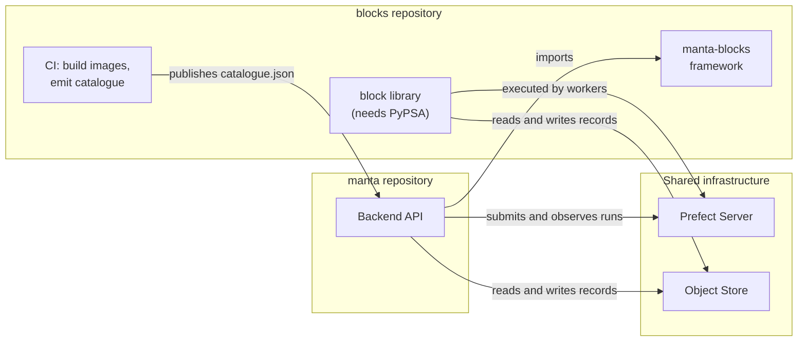

# 05 — Repository interface

How the `manta` and `blocks` repositories meet, and who owns what.

## The seam

**Decided:** Manta's backend takes a package dependency on `manta-blocks` — the
framework only, not the library of modelling blocks — and both sides talk to the same Prefect
server and the same object store.

There are three connections:

1. **A library dependency.** Manta imports the playbook document model, the catalogue
   model, validation, graphing and run control. Its runtime dependencies are Prefect,
   Pydantic, PyYAML and jsonschema — all of which Manta either already has or can
   trivially add. PyPSA is deliberately absent from the framework package.
2. **The catalogue as a build artefact.** `blocks` CI publishes a versioned
   `catalogue.json` describing every block in every environment. Manta loads it and
   serves it to the frontend.
3. **A shared Prefect server and object store.** Manta submits and observes; workers
   execute and store.

Manta never imports a block class, never needs a Pixi environment, and never needs
PyPSA. The `blocks` framework's default test environment having no PyPSA is what
proves this path works.

### Why not the alternatives

**Prefect only** — Manta submits `run_playbook/<env>` and imports nothing. Cleanest
possible coupling, but Manta loses validation, graphing and the catalogue, so the
frontend cannot build forms, mark errors or draw the canvas. The validation logic
would have to be reimplemented in TypeScript and kept in step by hand. Rejected.

**`blocks` as its own HTTP service** that Manta proxies to. Buys process isolation
that isn't needed — the framework has no heavy dependencies — and costs a service, a
schema and a deployment. Worth revisiting only if something that isn't Python needs to
consume the playbook engine.

## The catalogue contract

The catalogue is the most important artefact crossing the boundary, because it is what
lets Manta reason about code it cannot load.

| Property | Decision |
| --- | --- |
| **Produced by** | `blocks` CI, one invocation per environment, merged |
| **Contains** | Block name, environment, summary, dimensions, inputs, outputs, settings as JSON Schema; plus the environments themselves |
| **Versioned by** | `catalogue_version`, bumped when the shape changes so a reader can tell what it has |
| **Consumed by** | Manta at startup; served to the frontend at `GET /v1/blocks` |
| **Also carries** | *(proposed)* The container image for each environment, injected at publish time by the CI that built it |

That last row is worth dwelling on. A block declares `ENV` as a *logical* name —
`pypsa` — and knows nothing about registries or tags. Something must map that name to
`registry/manta-pypsa:2026.08.3`. The CI that built the image is the only component
that knows, and the catalogue is already the channel by which environment descriptions
reach Manta. Making the catalogue double as the environment-to-image manifest avoids
inventing a second artefact, and keeps registry configuration out of block source
code.

## Who owns what

| Concern | `blocks` | Manta |
| --- | --- | --- |
| Block and playbook semantics | ✅ Owns | Consumes |
| Playbook document schema | ✅ Owns | Stores instances of it |
| Validation, dimension folding, graphing | ✅ Owns | Calls it, maps issues to API responses |
| Deployment planning and name construction | ✅ Owns | Never constructs these strings |
| The `run_block` and `run_playbook` flows | ✅ Owns | Submits to them |
| Environment definitions, images, catalogue generation | ✅ Owns | Reads the result |
| Persistence — projects, playbooks, runs, artefacts | — | ✅ Owns |
| Identity, access control, tenancy | — | ✅ Owns |
| The HTTP API and the frontend | — | ✅ Owns |
| Infrastructure lifecycle: when to deploy, how many workers, pool sizing | — | ✅ Owns |
| Run state, logs, retries, history | *Prefect owns this. Neither repository stores it.* | |

## Plan, apply, policy

"Orchestration code" is really three separable things, and each belongs somewhere
different. 

| | What it is | Where it belongs | Why |
| --- | --- | --- | --- |
| **Plan** | Deriving *what* must exist: `(block, env)` pairs, deployment and pool names, environment conflicts, the orchestrator path | `blocks` | Pure functions over playbook semantics. Only `blocks` knows the block-to-environment mapping, and name construction must have exactly one home or the two repositories drift |
| **Apply** | Creating it against a target: Prefect deployments, containers, pods | Interface in `blocks`; implementations follow their target | The process/pixi provisioner serves the CLI, examples and tests, and stays. A Kubernetes provisioner needs registry, cluster, limits and secrets — all Manta's knowledge — so it belongs to Manta |
| **Policy** | *When* to deploy, how many, for whom, idempotency, what the user sees on failure | Manta | These are product events and infrastructure decisions. A library has no events and no database to be idempotent against |

Two concrete consequences for the current code:

- **Do not deploy on the run path.** `start_run` currently defaults to deploying
  first, which touches the Prefect API once per block on every single run. Deployment
  should happen at release time, or at most when a playbook is saved, with Manta's
  database recording what has been applied.
- **Pass the orchestrator environment explicitly.** It currently defaults to whatever
  environment the calling process happens to be in. That is correct for a
  command-line user and wrong for a server: Manta's backend does not run under Pixi,
  so the default would silently resolve to a pool that does not exist.

Both are one-line changes that turn convenient defaults into explicit inputs — right
for a library consumed by a service.

## What Manta exposes as a result

Because Manta holds the catalogue and the framework, its API can offer the frontend
everything needed to author a playbook without the frontend knowing anything about
blocks:

| Endpoint | Delegates to |
| --- | --- |
| `GET /v1/blocks` | The merged catalogue: block descriptions and settings schemas |
| `POST /v1/playbooks`, `GET`, `PUT` | Stores and returns playbook and configuration documents |
| `POST /v1/playbooks/{uuid}/validate` | `playbook.issues(config)` → a list of issues with step path, field and input |
| `GET /v1/playbooks/{uuid}/graph` | `playbook.to_graph(config)` → nodes and edges for the canvas |
| `POST /v1/runs` | Validate, resolve the input datarecord, submit, persist the link |
| `GET /v1/runs/{uuid}`, `/logs` | Prefect state and logs |

The frontend builds configuration forms from each block's JSON Schema, skipping fields
marked `x-manta-input`; renders the canvas from the graph; and marks errors using the
step path and field path on each issue. None of that requires the frontend — or Manta
— to know what a block does.

## Nested playbook resolution

A playbook step can reference another playbook by locator. `blocks` defines the
resolution mechanism as an interface rather than assuming files, precisely so a system
storing playbooks in a database can look them up there.

**Proposed:** Manta implements a loader that resolves locators against its own
playbook table, keyed by playbook UUID. Using a stable identifier matters — the
circular-reference check keys on whatever the loader reports, so an unstable key would
either miss a genuine cycle or invent one.

## Versioning between the repositories

Two version numbers already exist for this: `catalogue_version` and `graph_version`.
Manta pins a compatible range of `manta-blocks` in its dependencies, the way it pins
anything else.

The unresolved question is whether a *saved playbook* pins a catalogue version, so
that a playbook authored a year ago still validates against the blocks it was written
for. See [08](08-open-questions.md#catalogue-versioning-and-playbook-pinning).

## Where the team boundary falls

Worth stating because it usually decides these arguments in practice: code should sit
with whoever has the expertise and whoever gets paged when it breaks. Block and
environment semantics belong to the modelling side; infrastructure lifecycle and
tenancy belong to the platform side. The plan/apply/policy split above happens to fall
along exactly that line, which is a good sign it is the right split.
