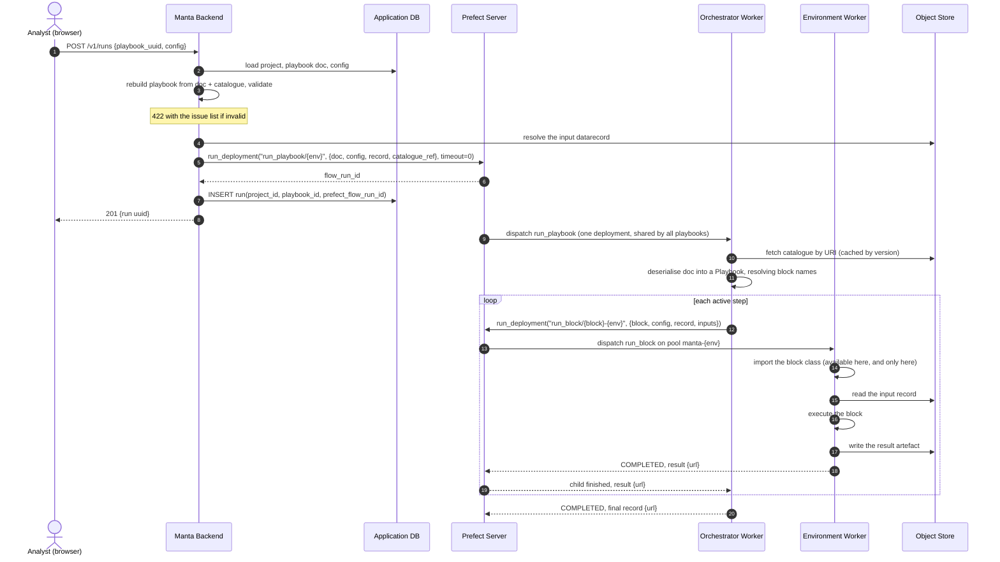
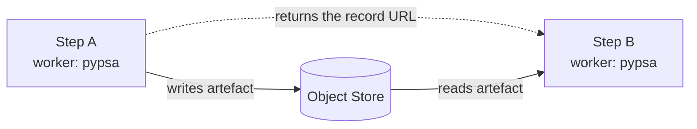

# 06 — Execution lifecycle

End to end, in three phases: what happens when blocks are released, what happens while
a user authors a playbook, and what happens when they press Run.

## Phase 0 — Release time

Performed by `blocks` CI and by whoever operates the deployment.
Nothing here is on a
user's request path, and none of it involves Manta's backend.

1. **Build each environment.** One container image per environment, from that
   environment's dependency set.
Third-party plug-in environments are built from their
   own repositories.
2. **Generate the catalogue.** Run `python -m blocks` inside each environment, merge
   the results, inject the image reference for each environment, publish
   `catalogue.json` with a version.
3. **Create work pools and start workers.** One pool per environment (`manta-<env>`),
   plus one orchestrator pool shared by every playbook.
A pool with no worker
   accumulates queued runs forever, so this is a prerequisite, not an optimisation.
In
   production these are declared in the cluster manifests rather than created by hand.
4. **Apply deployments.** One `run_block/<block>-<env>` per pair, plus a single
   `run_playbook/<orchestrator-env>` that serves every playbook in the system.
5. **Manta loads the catalogue** at startup and serves it at `GET /v1/blocks`.

## Phase 1 — Design time

The user is in the browser.
Nothing executes; no solver starts.

1.
The frontend fetches the catalogue and renders a palette of available blocks.
Each
   block's settings form is generated from its JSON Schema, skipping fields marked
   `x-manta-input` — those are wiring points, not user input.
2.
The user adds steps, wires outputs to inputs, sets conditions and fills in
   settings.
The frontend saves the playbook document and configuration document to
   Manta.
3. `POST /v1/playbooks/{uuid}/validate` → Manta rebuilds the playbook from its
   document using the catalogue, calls `issues(config)`, and returns the list.
Each
   issue carries the step path and the exact field, so the canvas marks the offending
   node and the form marks the offending input.
4. `GET /v1/playbooks/{uuid}/graph` → nodes, edges, per-step dimensions, and which
   steps will run under the current settings.
The canvas draws it, including the
   branches conditions have switched off.

Every step of this path runs in Manta's backend, which cannot import a single one of
the blocks involved.

## Phase 2 — Run time

Note that the backend's involvement ends at step 8.
Everything after that happens
without it, and would continue happening if it were restarted.

### Submission, in detail

`POST /v1/runs` does five things, in order:

1.
Loads the project, playbook document and configuration from the database.
2.
Rebuilds the playbook using the catalogue and validates it.
An invalid playbook
   fails here, with the issue list, before anything is submitted — a run that could
   not succeed is never started.
3.
Resolves the input `DataRecord`: the URL of the project's input model in the object
   store.
4.
Submits `run_playbook/<env>` with the document, configuration, record and catalogue
   reference as parameters, and returns immediately.
5.
Inserts the run row linking the project and playbook to the returned flow run id.

The playbook travels **as its document**, not as a reference.
What runs is what was on
screen when the user pressed Run, even if the stored playbook is edited a second
later.

#### Why validate again at submission

Playbooks are also validated when saved, and that check is the one that drives the
authoring UI.
Submission re-runs it because validation depends on the configuration
document, and the configuration in play at submission is not necessarily the one that
was saved.

Without a configuration, only the structural checks can run: unique step names, wires
pointing at earlier steps that offer that output, no nested-playbook cycles.
Everything else depends on knowing which steps will actually run, which is a function
of the settings:

| Check | Needs config? |
| --- | --- |
| Step names unique and usable | No |
| Wires reference an earlier step and a result it offers | No |
| No circular nested playbooks | No |
| A running step is not fed by a skipped one | Yes |
| Dimensions fold correctly through the active steps | Yes |
| Settings match each block's schema | Yes |
| `when` looks at a setting that exists | Yes |
| Blocks agree on shared environment names | Yes |

A run may also override the saved configuration, and the catalogue may have moved
since the playbook was saved.
The check is pure data — no imports, no I/O — so
re-running it costs almost nothing.

### Dispatch, in detail

One `run_playbook` deployment serves every playbook, so the first thing the
orchestrator does is turn the document it was handed back into a playbook.

**This is deserialisation, and it is cheap.** Only JSON crosses a Prefect parameter
boundary, so what arrives is the playbook document, not a `Playbook` object.
Rebuilding
it means parsing the JSON, looking up each step's block name in the catalogue to attach
its description, and recursing into nested playbooks.
No block is imported, nothing is
read from the object store, no modelling dependency is touched — which is why the
orchestrator environment can stay small and why this costs microseconds rather than
being a per-run overhead worth engineering around.

For each step that the conditions say will run, it:

- collects the wired inputs — the records produced by specific earlier steps;
- calls `run_deployment` for that step's `(block, environment)` deployment, passing
  the block name, that step's settings, the spine record and the wired inputs;
- blocks until the child finishes, and takes the returned record as the new spine
  record.

**Wired inputs are URLs, not data.** The orchestrator keeps a map of
`{step name: {output name: DataRecord}}`, and a `DataRecord` is `{"url": ...}`.
Wiring
a step means looking up the referenced entries in that map and passing them along as
plain JSON.
The orchestrator never opens the object store, never loads a network, and
ideally holds no storage credentials — it moves pointers around.
Only the environment
worker reads the bytes.

Nested playbooks recurse: an inner playbook becomes a subflow of the outer one, and
its steps become subflows of that.

Each step's flow is named after the step, so the run tree in Prefect mirrors the graph
the user drew.

### Execution, in detail

The environment worker picks up `run_block` and, for the first time in the whole
lifecycle, imports the actual block class.
This is the only process in the system that
can — it is running in the environment the block declared.

It merges the wired records into the block's settings, validates the merged settings,
instantiates the block fresh for this run, and calls it.
The block reads its input from
the object store, does its work, writes its result, and returns a record pointing at
it.

A fresh instance per run means a block never carries state between runs.

**What the settings validation catches.** This is full Pydantic validation of the
block's real settings model, run in the one process that can import it.
It catches two
things nothing upstream can:

- **A record wired into a setting that cannot hold one** — reported here, rather than
  surfacing as a confusing failure deep inside the block.
- **Rules the block expresses in code rather than schema.** `ClusterTime` requires
  exactly one of `segments` or `n_hours`, via a model validator.
That constraint cannot
  be represented in JSON Schema, so Manta's design-time validation is blind to it.

Everything a JSON Schema *can* express — types, required fields, ranges — was already
checked at authoring and submission time.
This is the last-mile check for the rest.

## How data moves between steps

Steps run in different processes, usually different containers, possibly on different
machines.
The only thing that crosses between them is a URL.

Two mechanisms are involved and both must work:

- **The record URL** travels through Prefect as the child flow run's return value.
  Because parent and child are separate processes, this requires Prefect result
  persistence backed by storage both can reach.
- **The artefact itself** lives in the object store, written by one worker and read by
  the next.

Neither shared memory nor a shared filesystem is available, and the design must not
grow a dependency on either.

## Observing a run

The frontend polls `GET /v1/runs/{uuid}`.
Manta looks up the Prefect flow run id, asks
Prefect for the run's state and for the states of its children, and returns both.
Because each child flow is named after its step, the frontend can colour the same
graph it drew at design time — no separate progress model is needed.

`GET /v1/runs/{uuid}/logs` returns the accumulated logs together with the current
state, so a caller knows whether they are still growing. [**TODO**: we probably need an endpoint to get the log of each block/step, not accumulated over the entire playbook.]

Per-step detail is reported where Prefect can supply it and omitted where it cannot,
so a missing detail degrades the response rather than failing it.

## Failure modes

| Failure | What happens | Who notices |
| --- | --- | --- |
| Playbook invalid | Rejected at submission with the issue list; nothing is queued | User, immediately |
| Prefect server unreachable at submission | `POST /v1/runs` fails; no run row is written | User, immediately |
| Work pool exists but has no worker | The run queues indefinitely in `PENDING` | Nobody, unless monitored — see [08](08-open-questions.md) |
| A block raises | That child flow run fails; the orchestrator's `run_deployment` raises; the parent run fails | Run state and logs |
| Orchestrator worker dies mid-run | The parent run fails or crashes; already-dispatched children continue and are orphaned | Run state |
| Manta backend restarts mid-run | Nothing.
The run continues; state is read live on the next request | Nobody |
| Object store unreachable from a worker | That block fails at read or write | Run logs |

The row worth designing against is the orchestrator dying: it holds a process open for
the entire duration of a playbook.
Keeping it on stable, long-lived infrastructure
rather than on ephemeral per-run infrastructure is the mitigation, and it is why the
orchestrator runs on a process pool even in Kubernetes deployments.
See
[07](07-deployment-topology.md).

## What the user sees

| Moment | Response |
| --- | --- |
| Press Run | `201` with a run identifier, immediately — no waiting |
| While running | Overall state plus per-step state, mapped onto the graph they authored |
| A step fails | The failed node is identified by name, with that step's logs |
| Complete | Terminal state and the output record, available for download or onward analysis |
