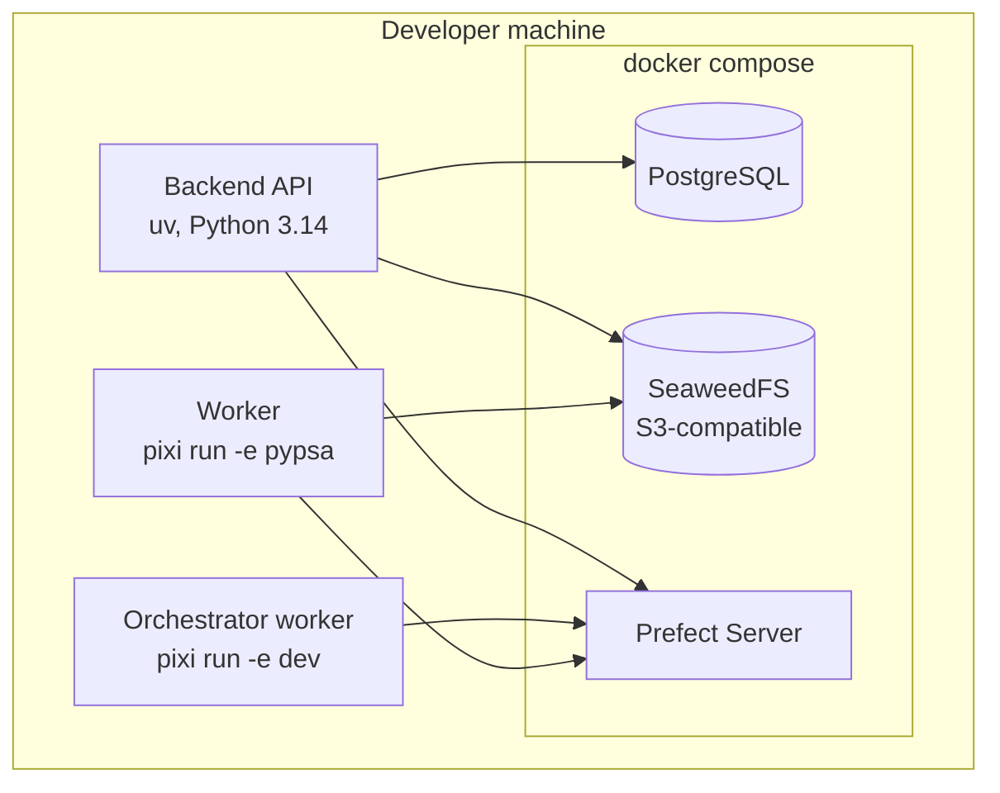
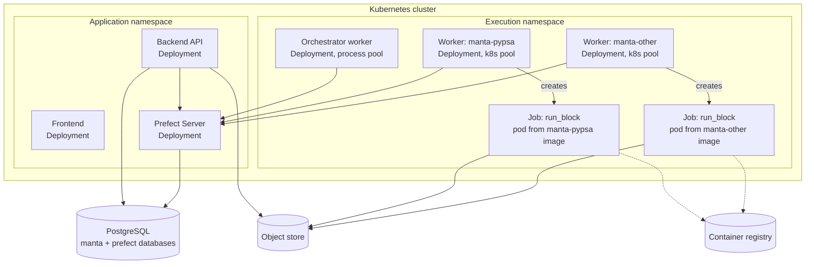

# 07 — Deployment topology

The same architecture runs on a developer's laptop, on OET's cloud, and inside a
client's Kubernetes cluster. What differs between them is confined to two things: how
an environment is materialised, and which provisioner turns a deployment plan into
Prefect deployments.

## Environments are the unit of isolation

A block declares the environment it needs as a logical name. That name becomes,
consistently:

| Concept | Name |
| --- | --- |
| Prefect work pool | `manta-<env>` |
| Prefect deployment for a block | `run_block/<block>-<env>` |
| Container image (production) | `<registry>/manta-<env>:<tag>` |
| Pixi environment (development) | `<env>` in the `blocks` manifest |

Pools scale with the **number of environments**, not with the number of playbooks or
users. Two environments serve any number of playbooks that only use blocks from them.
This is the right axis: environments are a property of the dependency graph, which
changes rarely, while playbooks are user content, which changes constantly.

*(An earlier plan proposed one work pool and worker per playbook. That was wrong for
this reason and is superseded here.)*

## Local development

Environments are Pixi environments; work pools are `process` type; workers are
`prefect worker start --pool manta-<env>` run inside the relevant Pixi environment,
which is what puts each block in the right place without anything having to activate
an environment itself.

Supporting services run under Docker Compose: PostgreSQL, SeaweedFS as the
S3-compatible object store, and the Prefect server. Integration tests boot the same
compose stack with ephemeral ports and an isolated project name, and spawn the API as
a subprocess against it.

Workers are **not** started by the application process. Earlier prototype code spawned
a flow-serving subprocess from application startup; that is a development convenience
that does not survive containerisation and is removed in the end state. Workers have
their own lifecycle, in every deployment target.

## Kubernetes

The production target. Blocks execute as Kubernetes Jobs: the worker for a pool does
not run flows itself, it watches its pool and creates a fresh pod per flow run from
that environment's image, then lets Kubernetes reap it.

### The orchestrator stays on a process pool

**Decided:** block execution uses Kubernetes work pools; the orchestrator does not.

`run_playbook` blocks for the entire duration of a playbook while its children run. As
a Kubernetes Job that means a pod idling for hours, exposed to eviction, preemption
and node drain — and if it dies mid-playbook the run fails while its already-dispatched
children carry on orphaned.

A long-lived process worker for orchestration is cheap (it calls out and waits, using
negligible CPU), has near-zero dispatch latency because it is already running, and is
stable. Kubernetes Jobs for the actual modelling work give per-run isolation and no
idle compute. Mixing pool types in one Prefect server is normal; each deployment
targets its own pool.

The cost is that these are two distinct worker processes — a Prefect worker polls one
pool only.

### What changes between targets

| | Local / Compose | Kubernetes |
| --- | --- | --- |
| Environment is | A Pixi environment | A container image |
| Work pool type | `process` | `kubernetes` (blocks), `process` (orchestrator) |
| A block run is | A subprocess of the worker | A Job, i.e. a fresh pod |
| Pools and workers created by | An operator, from printed commands | Cluster manifests, under version control |
| Provisioner | Process/Pixi | Kubernetes |
| Data between steps | Object store (already; no shared filesystem shortcut) | Object store |
| Isolation between runs | Process | Pod |

Application code is identical in both. `run_deployment` and reading state back do not
change; this is a deployment-target change, not an architecture change.

## What Kubernetes requires that does not exist yet

Three of these are prerequisites rather than refinements, and two of them are worth
building and testing on Compose *first*, because they fail in ways that only appear
once workers are genuinely separate.

1. **Records must live in the object store.** Block library code currently writes
   result files beside the input file on a local filesystem. Every step is now a fresh
   pod with an empty disk, so this stops working entirely. This is confined to one
   module by design, but it is a blocker rather than a cleanup.
2. **Prefect result persistence must be configured**, backed by storage every pod can
   reach. The orchestrator reads each child's return value across a process boundary;
   on one machine that can work by accident, across pods it cannot.
3. **Resource requirements must be declared.** No block currently states CPU, memory
   or wall time. On a developer's machine that is tolerable; a solver pod with no
   memory limit is an outage. Only the block author knows that a particular MILP needs
   32 GiB, so the declaration belongs on the block and flows through the deployment
   plan into the Job specification.
4. **An environment-to-image mapping**, injected into the catalogue by the CI that
   built the images. See [05](05-repository-interface.md#the-catalogue-contract).
5. **A Kubernetes provisioner**, the second implementation of the existing interface,
   adding image, namespace, service account, secrets and resource limits to each
   deployment. One gotcha to verify early: a deployment records the flow's entrypoint
   as an import path, which must resolve identically inside the image.

Suggested order: 1 and 2 first, on Compose with SeaweedFS, because they carry the real
risk. Then 3, then 4 and 5, which are plumbing.

## Prefect's metadata store

Shared PostgreSQL server, separate database, separate role — so the boundary is
enforced by PostgreSQL's own permissions rather than by convention. Configuration is a
single connection URL.

Moving Prefect to its own server later is a connection-string change with no
application code involved. Reasons that would justify it: Prefect's queries affecting
Manta's API latency, retention and vacuum operations causing disk contention, or
backup and recovery policies needing to diverge.

## Scaling characteristics

| Dimension | Behaviour |
| --- | --- |
| Concurrent runs | Bounded by work pool concurrency limits, configured per pool in Prefect |
| Many playbooks | No effect on infrastructure — playbooks are data |
| A new environment | One image, one pool, one worker deployment |
| Bursty load | Kubernetes pools absorb it: pods exist only while a run is in flight |
| Long playbooks | Hold an orchestrator slot for their duration; size the orchestrator's concurrency for the expected number of simultaneous playbooks, not steps |
| Idle cost | One small worker pod per environment plus one orchestrator. Execution pods scale to zero |

## Testing strategy

The provisioner interface is what makes this tractable.

- **Unit tests** mock Prefect entirely; no server involved.
- **Integration tests** run against the Compose stack with `process` pools — real
  Prefect, real submit-execute-observe loop, real object store, no cluster.
- **Kubernetes** is exercised in a dedicated environment, or with `kind`/`k3d` in CI
  if the cost is justified. It is not the default test target and does not need to be:
  what differs from the tested path is confined to the provisioner and the Job
  specification.

Per the security policy, test data is synthetic-first; production grid data is never
used in non-production environments.

## Security notes for the execution tier

Collected here because they are properties of the topology rather than of any one
component. These become requirements at M4, when the platform handles Internal and
Confidential data — but the topology should not foreclose them now.

- **The Prefect server is internal.** It has no end-user authentication model and its
  UI exposes every run in the system. It must not be reachable from the internet.
- **Execution is a separate namespace** from the application, with network policy
  restricting what an execution pod may reach: the Prefect API and the object store,
  and nothing else.
- **Credentials reach pods as secrets**, scoped to what that pod needs — most
  importantly, object store credentials scoped to the run's own data rather than the
  whole bucket.
- **Per-run pod isolation** means one run cannot observe another's memory or scratch
  disk. This is a real security control once tenants share a cluster, not just an
  operational nicety.
- **Third-party block code executes inside this tier.** Everything above is what
  contains it. See
  [08](08-open-questions.md#the-plug-in-trust-boundary) — this is the largest open
  security question in the design.
